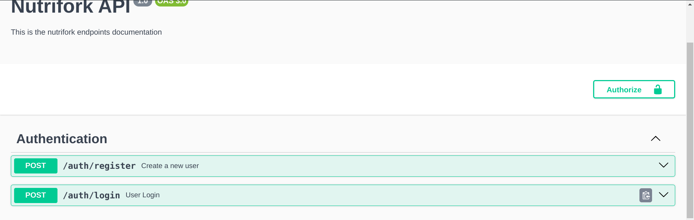
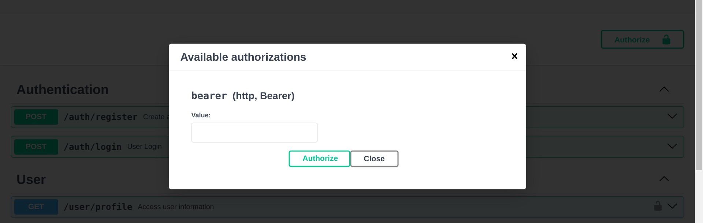

<p align="center">
  <a href="http://nestjs.com/" target="blank"></a>
</p>

[circleci-image]: https://img.shields.io/circleci/build/github/nestjs/nest/master?token=abc123def456
[circleci-url]: https://circleci.com/gh/nestjs/nest

  <p align="center">A progressive <a href="http://nodejs.org" target="_blank">Node.js</a> framework for building efficient and scalable server-side applications.</p>
    <p align="center">
<a href="https://www.npmjs.com/~nestjscore" target="_blank"></a>
<a href="https://www.npmjs.com/~nestjscore" target="_blank"></a>
<a href="https://www.npmjs.com/~nestjscore" target="_blank"></a>
<a href="https://circleci.com/gh/nestjs/nest" target="_blank"></a>
<a href="https://coveralls.io/github/nestjs/nest?branch=master" target="_blank"></a>
<a href="https://discord.gg/G7Qnnhy" target="_blank"></a>
<a href="https://opencollective.com/nest#backer" target="_blank"></a>
<a href="https://opencollective.com/nest#sponsor" target="_blank"></a>
  <a href="https://paypal.me/kamilmysliwiec" target="_blank"></a>
    <a href="https://opencollective.com/nest#sponsor"  target="_blank"></a>
  <a href="https://twitter.com/nestframework" target="_blank"></a>
</p>
  <!--[](https://opencollective.com/nest#backer)
  [](https://opencollective.com/nest#sponsor)-->

# Nutrifork API

## Descripción

Este es la API utilizada para manejar la información de las recetas, usuarios e interacciones con estas mismas.

## Requisitos de instalación

- NodeJS V20+.
- Poseer una cuenta en cloudinary (para cambiar foto de perfil).

## Manual de instalación

1. Crear un archivo **.env**.
2. Copiar las variables de entorno del archivo .dev.env al archivo .env
3. Reemplazar las variables copiadas, con las que utilizaremos (Cloudinary credentials, MongoDB URI y JWT SECRET para el token).
4. Ejecutar el siguiente comando desde la raiz del directorio server:
```bash
npm install
```

## Instrucciones para levantar el proyecto

1. Ejecutar el siguiente comando desde la raiz del directorio server
```bash
npm run start:dev
```

Y listo, con eso ya puedes utilizar la API del proyecto.

## Documentación de los endpoints.
1. Si desea consultar los endpoints de la API acceda al enlace siguiente [localhost:3000/docs](http://localhost:3000/docs).

Puede que algunos endpoints no sean del todo públicos ya que se utilizan preferencias de los usuarios, para ello al momento de probar, copie el token de su login y acceda al botón de Authorize, donde se le solicitara, tras haberlo aceptado, ya puede acceder a todas las funcionalidades.





## Términos utilizados dentro de la API

- **DTO** o data transfer object es utilizado para estandarizar y validar los datos que recibirá un método POST, PATCH, o PUT.
- **Doc** es un tipo de clase que transforma un objecto de Typescript en otra basado en los campos que este posee.
- **Guards** son decoradores que nos sirven para permitir el acceso a endpoints bajo ciertas circunstancias.
- **Prisma** ORM/ODM utilizado en este proyecto para conectar a una base de datos de MongoDB.

## Créditos

- Autor de NestJS - [Kamil Myśliwiec](https://kamilmysliwiec.com)
  
## Licencia del framework

Nest posee una licencia [MIT](LICENSE).
